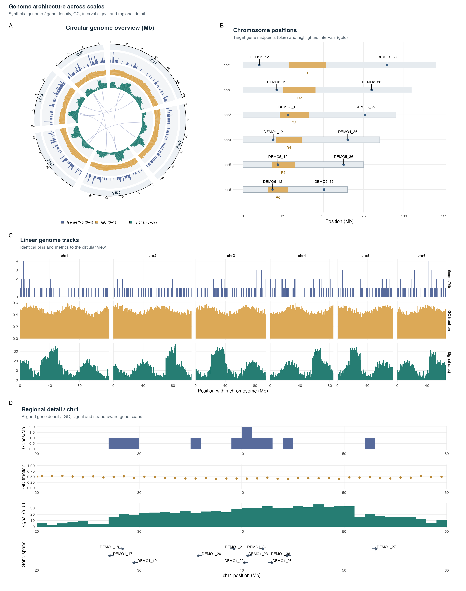

# Genome Visualization in R

Reusable templates for chromosome maps, linear and circular genome tracks, interval connections and regional views. All figures share one synthetic genome, consistent chromosome order and explicit coordinate conventions.



## Run

Install the packages listed at the top of `run.R`, then run from this directory:

```r
source('run.R')
```

Or use `Rscript run.R`. Five individual figures and one composite are exported as PNG and vector SVG. No online data retrieval is required after installation.

## Figures

| Output | Content |
|---|---|
| `positions` | Chromosome lengths, target genes and highlighted regions |
| `linear` | Gene density, GC fraction and interval signal across chromosomes |
| `circular` | The same three metrics, with genomic interval ribbons |
| `links` | Interval-to-interval connections without additional tracks |
| `regional` | Aligned metrics and strand-aware gene spans in a selected window |
| `combined` | Global views and regional detail with panel labels and unequal row heights |

## Structure

```text
run.R       Dependencies, configuration and export
plots.R     Data generation, validation and plotting functions
README.md   Usage and data conventions
data/       Five example CSVs
figures/    PNG and SVG outputs
```

## Input data

| File | Required columns |
|---|---|
| `chromosomes.csv` | `chr`, `length` |
| `bins.csv` | `chr`, `start`, `end`, `gene_density`, `gc`, `signal` |
| `genes.csv` | `chr`, `start`, `end`, `gene`, `strand`, `target` |
| `regions.csv` | `chr`, `start`, `end`, `label` |
| `links.csv` | `chr1`, `start1`, `end1`, `chr2`, `start2`, `end2` |

**Coordinates are integer base pairs, 1-based and closed:** both endpoints belong to the interval; width is `end - start + 1`. Convert BED starts with `start + 1`, keeping BED ends unchanged. For drawing interval boundaries, the scripts use `[start - 1, end]`, displayed in Mb.

`chromosomes.csv` defines chromosome order for every figure. Names must match exactly; intervals must stay within chromosome bounds. Bins must not overlap. Missing, nonfinite or invalid coordinates are rejected. `strand` is `+` or `-`; `target` is `TRUE` or `FALSE`.

The example contains six fictional chromosomes, 545 one-megabase bins, 288 gene spans, six highlighted regions and eight links. It does not represent a biological reference assembly. Gene density counts gene midpoints per Mb; GC is a simulated fraction in [0, 1]; signal is simulated in arbitrary units. Links are illustrative correspondences, not inferred rearrangements, and ribbon width reflects interval span. Gene arrows show whole-gene spans and direction, not exon structure.

## Customize

Set `zoom_chr`, `zoom_start`, `zoom_end` and `image_dpi` in `run.R`. Adjust the patchwork design (`AB / CC / DD`) and row heights to change the composite layout. Set `regenerate_example <- TRUE` only to overwrite the five example CSVs with reproducible data (seed 42).

Functions in `plots.R` can be reused independently. The linear and regional plots use ggplot2 and patchwork; circular plots use circlize and are captured as vector grobs with gridGraphics. Ordinary runs preserve input data.

Tested with R 4.6.1 on macOS; package versions are listed in `run.R`.

## References

[circlize](https://jokergoo.github.io/circlize_book/book/) · [ggplot2](https://ggplot2.tidyverse.org/) · [patchwork](https://patchwork.data-imaginist.com/)
